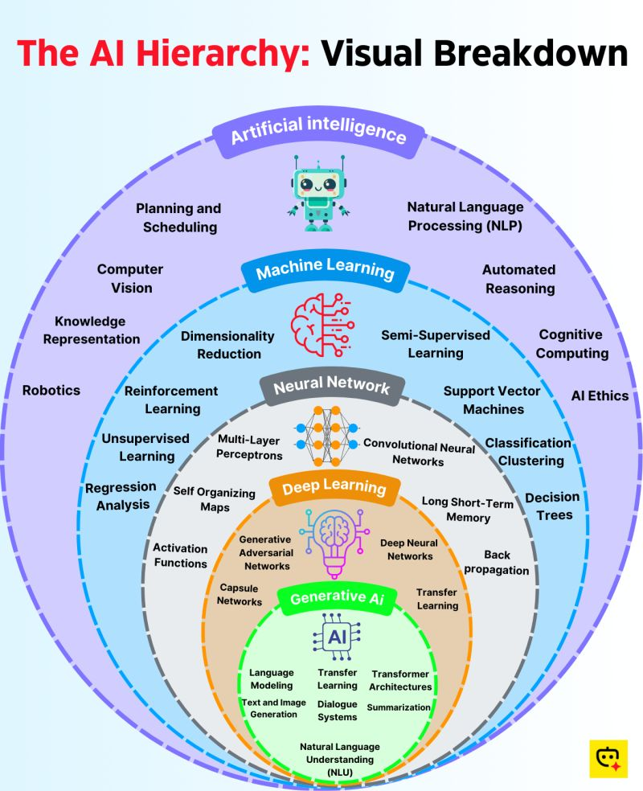

# Artificial Intelligence (AI), Machine Learning (ML), Deep Learning (DL), NLP, and LLMs: An Intuitive Guide

---

## 1. Artificial Intelligence (AI)
**AI** is the broadest field, focused on making machines act “intelligently.”  
It encompasses rule-based systems, search algorithms, planning, and machine learning.

**Applications:**
- Game AI: chess, Go, video games
- Expert systems: medical diagnosis, legal advice
- Robotics: autonomous navigation
- Chatbots & personal assistants: Siri, Alexa
- Decision-making: finance, business

---

## 2. Machine Learning (ML)
**ML** is a subset of AI where models learn patterns from data, improving over time without explicit programming.

### 2.1 Supervised Learning
- **Regression:** Predict numbers  
  *Examples: house prices, stock forecasting, weather prediction*
- **Classification:** Predict categories  
  *Examples: spam detection, disease diagnosis, fraud detection*

### 2.2 Unsupervised Learning
- **Clustering:** Group similar items  
  *Examples: customer segmentation, anomaly detection, topic grouping*
- **Dimensionality Reduction:** Simplify data  
  *Examples: data visualization, feature reduction*

### 2.3 Semi-Supervised Learning
- Uses both labeled & unlabeled data  
  *Examples: speech recognition, medical image labeling*

### 2.4 Reinforcement Learning (RL)
- Learning via trial-and-error feedback  
  *Examples: robotics, game playing (AlphaGo), self-driving cars, recommendations*

---

## 3. Deep Learning (DL)
**DL** is a subset of ML using neural networks with many layers ("deep" networks).

### 3.1 Artificial Neural Networks (ANNs)
- Basic building blocks of DL  
  *Examples: credit risk, churn prediction, pattern recognition*

### 3.2 Convolutional Neural Networks (CNNs)
- Specialized for images & spatial data  
  *Applications:*
    - Image classification (cats vs dogs, X-rays)
    - Object detection (self-driving cars)
    - Image segmentation (medical imaging)
    - Face recognition (security)

### 3.3 Recurrent Neural Networks (RNNs)
- Designed for sequential data (time series, language)
  - **LSTM/GRU:** Improved RNNs for longer sequences
  *Applications:*
    - Time series forecasting
    - Speech recognition
    - Language modeling
    - Machine translation

### 3.4 Transformers (Revolutionary Architecture)
- Handle long-range dependencies in sequences  
  *Applications:*
    - BERT: sentiment analysis, Q&A, understanding
    - GPT: text generation, chatbots
    - Vision Transformers (ViT): images, video

### 3.5 Generative Models
- **GANs (Generative Adversarial Networks):** deepfakes, art, image translation
- **VAEs (Variational Autoencoders):** anomaly detection, drug discovery

---

## 4. Natural Language Processing (NLP)
**NLP** = AI for human language (text & speech).

### 4.1 Traditional NLP (ML-based)
- **Bag of Words, TF-IDF:** search engines, spam filtering
- **Word2Vec/GloVe:** word embeddings for sentiment analysis, chatbots

### 4.2 Deep Learning in NLP
- **RNN/LSTM/GRU models:** chatbots, machine translation, speech-to-text
- **Seq2Seq models:** translation, summarization, Q&A

### 4.3 Transformers in NLP
- **BERT:** understanding, search engines, sentiment analysis
- **GPT:** chatbots, text/story generation
- **T5, XLNet, RoBERTa:** summarization, paraphrasing, knowledge extraction

---

## 5. Large Language Models (LLMs)
**LLMs** are massive models (billions of parameters), built using DL and Transformers, focused on language tasks.

**Examples:**  
- GPT-family (GPT-3, GPT-4, GPT-5)
- LLaMA, Falcon, Mistral
- PaLM (Google), Gemini

**Applications:**
- Conversational AI (ChatGPT, Claude, Bard)
- Code generation (Copilot)
- Document summarization
- Content creation (blogs, marketing)
- Reasoning & problem-solving (math, logic, tutoring)
- Multi-modal AI (image + text → description)

---

## 🔹 Visual Flowchart (Text Version)
```
Artificial Intelligence (AI)
│
├── Machine Learning (ML)
│   ├── Supervised Learning (Regression, Classification)
│   ├── Unsupervised Learning (Clustering, Dimensionality Reduction)
│   ├── Semi-Supervised Learning
│   └── Reinforcement Learning
│
├── Deep Learning (DL)
│   ├── ANNs
│   ├── CNNs
│   ├── RNNs (LSTM, GRU)
│   ├── Transformers (BERT, GPT, ViT)
│   └── Generative Models (GANs, VAEs)
│
├── Natural Language Processing (NLP)
│   ├── Traditional NLP (Bag of Words, TF-IDF, Word2Vec)
│   ├── Deep Learning NLP (RNNs, Seq2Seq)
│   └── Transformers NLP (BERT, GPT, T5, XLNet, RoBERTa)
│
└── Large Language Models (LLMs)
    ├── GPT-family, LLaMA, Falcon, Mistral, PaLM, Gemini
    └── Applications: ChatGPT, Copilot, Claude, Bard
```

---

## 🎯 Roadmap Summary

- **AI:** The umbrella field
- **ML:** Learning from data
- **DL:** Advanced ML with neural nets
- **CNNs:** DL for images
- **RNN/LSTM/Transformers:** DL for sequences (text, speech)
- **NLP:** AI for language
- **LLMs:** NLP + Transformers at massive scale

---

## 🧠 Practical Use Cases

| Field         | Example Use Cases                              |
|---------------|-----------------------------------------------|
| AI            | Chatbots, Game AI, Robotics                   |
| ML            | Fraud detection, Regression, Recommendations  |
| DL            | Face recognition, Speech-to-text, Deepfakes   |
| NLP           | Search engines, Sentiment analysis            |
| LLMs          | ChatGPT, Document summarization, Copilot      |

---

**If you want a visual diagram (boxes/arrows), try tools like draw.io or diagrams.net to map the above flow!**
